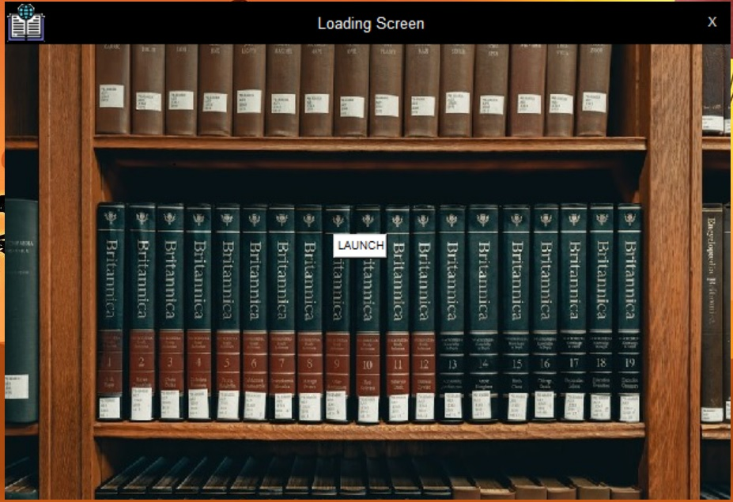
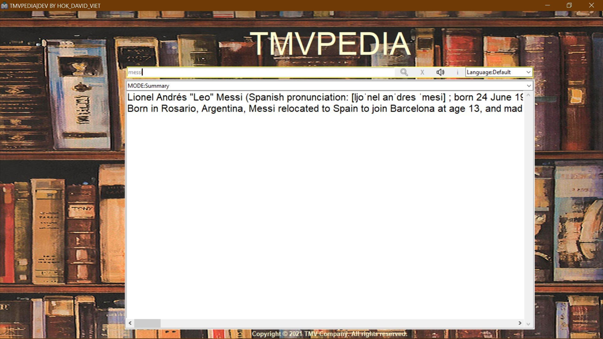
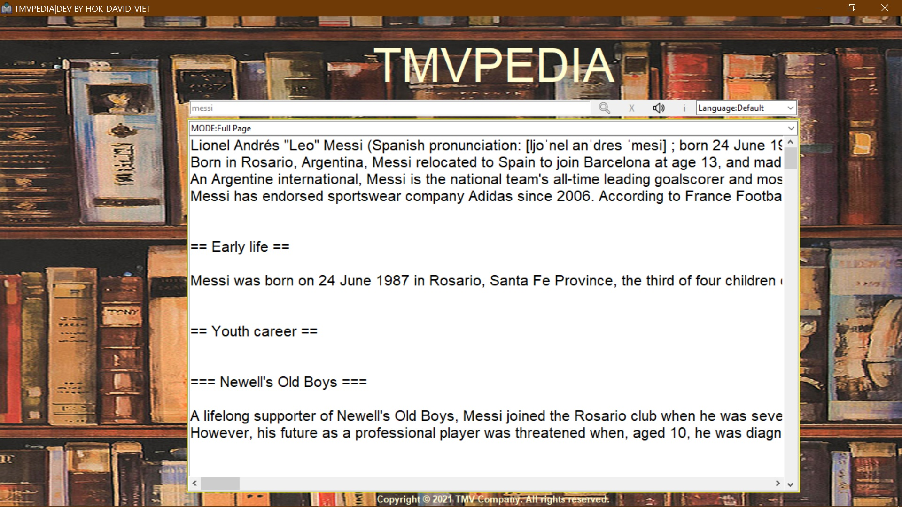
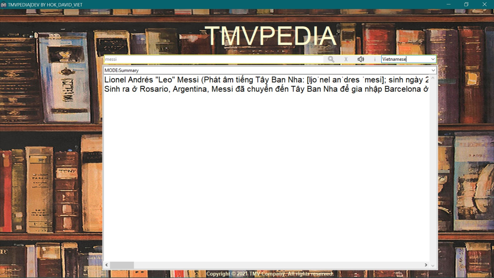

# TMVpedia

TMVpedia is a Python application that uses Wikipedia, Google Translator, and various other libraries to provide a rich user interface for accessing and translating Wikipedia articles.

---

## Author
Viet Quoc Tran (Vincent)

---

## Application Screenshots
- Loading screen


- Search



- Translation


---

## Prerequisites

Before you begin, ensure you have met the following requirements:

- You have installed Python 3.x on your machine.
- You have installed the required libraries listed in the `requirements.txt` file.

---

## Installation

1. Clone the repository or download the source code.
2. Navigate to the project directory.
3. Install the required libraries using pip:

    method 1: use requirements.txt
    ```bash
    pip install -r requirements.txt
    ```

    method 2: mannual installation in the follow order
    ```bash
    - pip install wikipedia
    - pip install googletrans
    - pip install Pillow
    - pip install pyttsx3
    - pip install pywin32
    - pip install pygame
4. Install fonts
    - go to `resources/fonts` and install all the fonts listed in there

---

## Usage

1. Run the [TMVpedia.py](http://_vscodecontentref_/0) script:

    ```bash
    python TMVpedia.py
    ```
    or run the app by simply click on TMVpedia.exe

2. The application window will open. You can use the various features provided by the application, such as searching Wikipedia articles, translating text, and using text-to-speech.

---

## Features

- **Wikipedia Search**: Search for articles on Wikipedia.
- **Google Translate**: Translate text using Google Translator.
- **Text-to-Speech**: Convert text to speech using pyttsx3.

---

## Libraries Used

- [wikipedia](http://_vscodecontentref_/1)
- [googletrans](http://_vscodecontentref_/2)
- [tkinter](http://_vscodecontentref_/3)
- `Pillow`
- `pyttsx3`
- `pygame`
- [time](http://_vscodecontentref_/4)

---

## Notes

- Ensure you have an active internet connection for Wikipedia and Google Translate functionalities.
- The application uses threading to reduce lag and avoid freezing.

